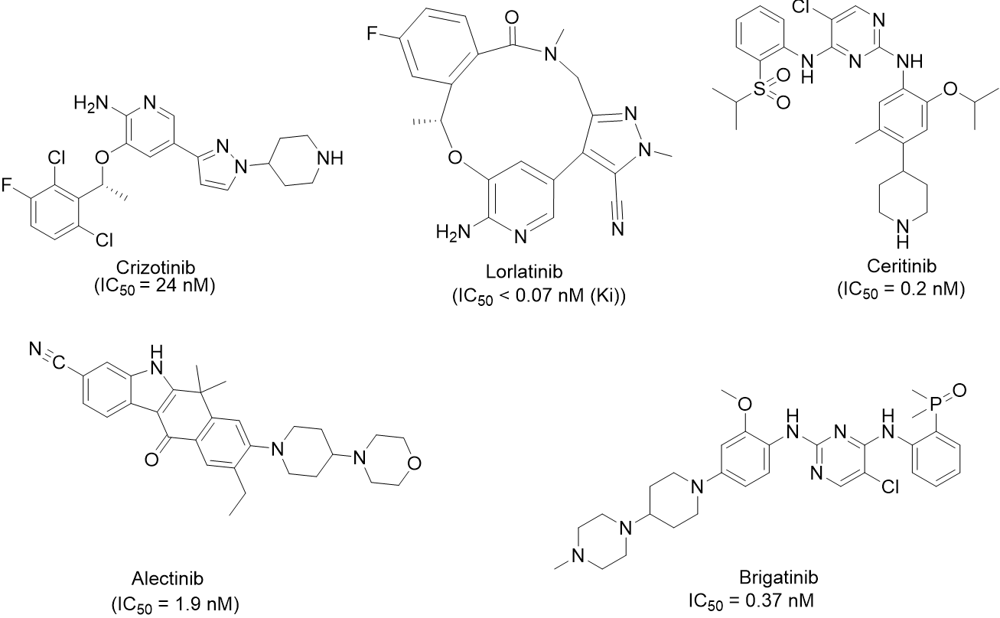
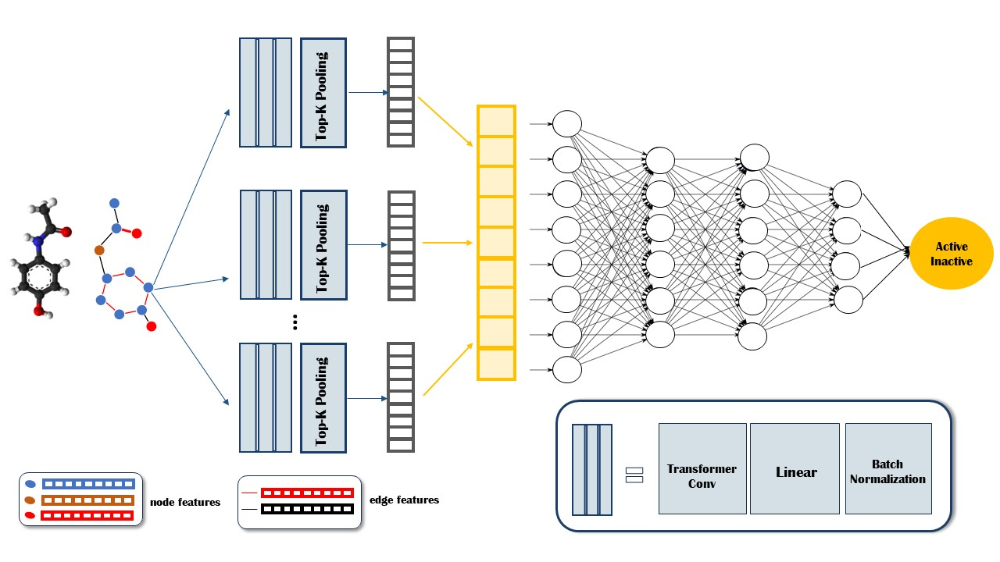

# KSE-BCB2023-GNN-ALK

# KSE-BCB2023-GNN-ALK

**A graph neural network model enables accurate prediction of Anaplastic lymphoma kinase inhibitors**

**Abstract**
- *Purpose*: Anaplastic lymphoma kinase (ALK), a tyrosine kinase receptor, is defined as an important target in the development of anticancer drugs for non-small cell lung cancer. In the present work, we have performed a graph neural network (GNN) model for rapid anticancer bioactivity prediction.
- *Materials and methods*: ALK inhibitors with IC50 values were taken from the REAXYS database. After preprocessing, all these inhibitors resulted in a dataset of 1664 molecules. Then, a GNN model was built on a training set. The generalization power of the models was assessed by internal and external validation procedures.
- *Results*: The graph neural network model achieved promising results, with an average precision of 0.879 and an F1 score of 0.804 in cross-validation. In external validation, the model achieved an average precision of 0.938 and an F1 score of 0.863.
- *Conclusion*: We can conclude that the forecast model obtained by the graph neural network is suitable for the problem and can be employed to predict the biological activity of new ALK inhibitors. 

Keywords: Anaplastic lymphoma kinase; Graph neural network; Deep learning model; Non-small cell lung cancer; Drug classification.

- The source code, all datasets, and the results of this study are available at https://github.com/Medicine-Artificial-Intelligence/KSE-BCB2023-GNN-ALK: 
- The deployment model is available at: https://huggingface.co/spaces/thechuongtrinh/ALK_inhibitors_classification

# Contributors
- [The-Chuong Trinh](https://trinhthechuong.github.io/)
- [Van-Thinh To](https://thinhump.github.io/)
- [Phuoc-Chung Nguyen Van](https://www.facebook.com/chung.nguyenvanphuoc.9)
- [Thanh-An Pham](https://thanh-an-pham.github.io/)
- [Tieu-Long Phan](https://tieulongphan.github.io/)
- [Ngoc-Tuyen Truong](https://scholar.google.com/citations?hl=vi&user=qx3eMsIAAAAJ) - [Corresponding author](mailto:truongtuyen@ump.edu.vn)

